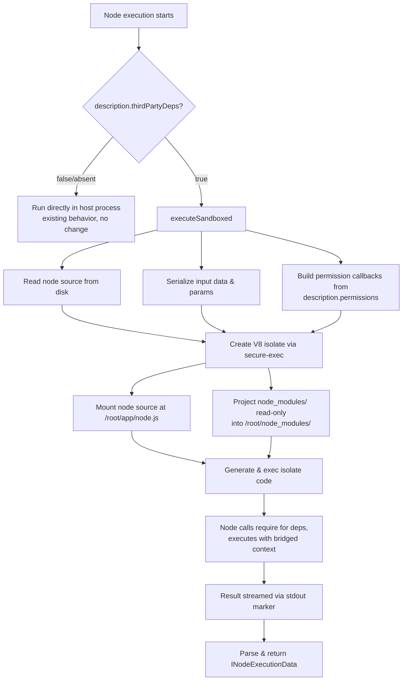

# Sandboxed Node Execution

Secure, sandboxed execution environment for community nodes that use 3rd-party
npm dependencies. Powered by [secure-exec](https://github.com/rivet-dev/secure-exec)
V8 isolates — no containers, no VMs.

## Motivation

Community nodes in n8n currently cannot safely import 3rd-party npm packages.
All node code runs directly in the host process, which means any dependency a
community node installs has full access to the filesystem, network, environment
variables, and child processes. This makes it impossible to trust arbitrary
community packages.

This feature adds an **opt-in sandboxed execution path**: when a community node
declares that it uses 3rd-party dependencies, n8n automatically runs it inside
a V8 isolate with deny-by-default permissions. Existing nodes are completely
unaffected — no migration required.

## How It Works



## New Node Description Properties

Two new optional fields on `INodeTypeDescription`:

### `thirdPartyDeps`

```typescript
thirdPartyDeps?: boolean;
```

**The primary sandbox trigger.** Set to `true` when the node bundles or
requires 3rd-party npm packages. This tells n8n to execute the node inside
a secure-exec V8 isolate instead of the host process.

- When absent or `false` — node runs directly in the host (existing behavior)
- When `true` — node runs in the sandbox with deny-by-default permissions
- The node's own `node_modules/` is projected read-only into the isolate so
  `require()` works for shipped dependencies

### `permissions`

```typescript
permissions?: NodePermissionDescriptor;
```

**Optional fine-grained capability declarations.** Only meaningful when
`thirdPartyDeps` is `true`. Controls what the sandbox is allowed to access
beyond the default deny-all policy.

```typescript
interface NodePermissionDescriptor {
  // Allow direct outbound network access from the isolate
  network?: boolean | { allowedHosts?: string[] };

  // Allow direct filesystem access from the isolate
  filesystem?: boolean | { paths?: string[]; readonly?: boolean };

  // Allow spawning child processes from the isolate
  childProcess?: boolean | { allowedCommands?: string[] };

  // Allow reading host environment variables from the isolate
  env?: boolean | { allowedKeys?: string[] };
}
```

Each permission can be set to:
- `true` — unrestricted access for that capability
- An object with constraints — access limited to the specified scope
- Absent — capability is denied (default)

## Design Decisions

### Opt-in, not forced

Sandboxing is an **opt-in feature unlock**. Existing community nodes continue
to work exactly as before. Only nodes that declare `thirdPartyDeps: true` enter
the sandbox path. This avoids a breaking migration for the community.

### Resource limits are admin-controlled

`memoryLimitMb` and `cpuTimeLimitMs` are **not** part of the node description.
They are operational concerns controlled by administrators, not capabilities
for node developers to declare. Currently set to:
- Memory: 64 MB per isolate
- CPU time: 10,000 ms per execution

### Context bridging

Code inside the V8 isolate cannot directly call n8n's `IExecuteFunctions`.
Instead, a minimal context shim bridges key methods:

| Bridged method | What it does in the isolate |
|---|---|
| `this.getInputData()` | Returns pre-serialized input items |
| `this.getNodeParameter(name, index)` | Returns pre-resolved parameter values |
| `this.getNode()` | Returns basic node metadata |
| `this.helpers.httpRequest()` | Makes HTTP requests (subject to network permissions) |
| `this.helpers.returnJsonArray()` | Wraps raw data into `INodeExecutionData[]` |
| `this.helpers.constructExecutionMetaData()` | Pass-through for metadata |
| `this.helpers.prepareBinaryData()` | Encodes binary data as base64 |
| `this.continueOnFail()` | Always returns `false` |
| `this.getCredentials()` | Returns empty object (not yet bridged) |

### async execution via exec() mode

secure-exec's `exec()` mode is used so the async Promise from
`node.execute()` becomes the last expression (`__scriptResult__`), which
secure-exec awaits before releasing the context. The serialized result is
streamed back via `console.log` with a marker prefix (`__N8N_SANDBOX_RESULT__:`).

## Testing with the Reference Community Nodes

Two reference community nodes live in `community-nodes/` at the repo root.
Use them to verify the sandbox end-to-end.

### 1. Build the community nodes

```bash
# JSONPlaceholder node (lodash + https, with network permission)
cd community-nodes/n8n-nodes-jsonplaceholder
npm install
npm run build

# Blocked node (https without permission — should fail)
cd ../n8n-nodes-blocked
npm install
npm run build
```

### 2. Install them into your local n8n

n8n loads community nodes from `~/.n8n/nodes/node_modules/`. Install the
built packages there:

```bash
mkdir -p ~/.n8n/nodes
cd ~/.n8n/nodes

# Install from the local build output
npm install /path/to/n8n/community-nodes/n8n-nodes-jsonplaceholder
npm install /path/to/n8n/community-nodes/n8n-nodes-blocked
```

### 3. Start n8n and test

```bash
# From the repo root
pnpm dev
```

Open the n8n editor, create a new workflow, and add the nodes:

- **JSONPlaceholder** — should appear in the node picker. Set Resource to
  "Post", Operation to "Get", ID to `1`, then execute. You should see a
  JSON response with `id`, `title`, `body`, `userId` fields. This confirms
  the sandbox allows the declared host and lodash works via `require()`.

- **Blocked Demo** — add it and execute. It should **fail** with a permission
  error (`EACCES` or `ENOSYS`), confirming the sandbox blocks network access
  when no `permissions.network` is declared.

### What each node demonstrates

| | JSONPlaceholder | Blocked Demo |
|---|---|---|
| `thirdPartyDeps` | `true` | `true` |
| `permissions.network` | `{ allowedHosts: ['jsonplaceholder.typicode.com'] }` | not declared |
| 3rd-party dep | `lodash` | none |
| Expected result | Success — returns API data | Fails — blocked by sandbox |

### Example: node with network + 3rd-party deps

```typescript
import _ from 'lodash';
import https from 'https';
import type { INodeType, INodeTypeDescription, IExecuteFunctions } from 'n8n-workflow';

export class MyNode implements INodeType {
  description: INodeTypeDescription = {
    displayName: 'My Node',
    name: 'myNode',
    // ...

    thirdPartyDeps: true,

    permissions: {
      network: { allowedHosts: ['api.example.com'] },
    },

    properties: [/* ... */],
  };

  async execute(this: IExecuteFunctions) {
    // lodash, https, and other shipped deps are available via import
    // Network access is restricted to api.example.com only
    // Filesystem, child_process, env are all denied
  }
}
```

### Example: node with filesystem access

```typescript
import type { INodeType, INodeTypeDescription } from 'n8n-workflow';

export class FileReader implements INodeType {
  description: INodeTypeDescription = {
    // ...
    thirdPartyDeps: true,

    permissions: {
      filesystem: { paths: ['/tmp/data/'], readonly: true },
    },

    properties: [/* ... */],
  };
}
```

## Files Changed

| File | What changed |
|---|---|
| `packages/workflow/src/interfaces.ts` | Added `thirdPartyDeps` and `permissions` to `INodeTypeDescription`; added `NodePermissionDescriptor` interface |
| `packages/core/src/execution-engine/sandboxed-node-executor.ts` | New file — core sandbox implementation using secure-exec V8 isolates |
| `packages/core/src/execution-engine/load-secure-exec.js` + `.d.ts` | ESM import helper — preserves real `import()` since tsc rewrites it to `require()` |
| `packages/core/src/execution-engine/workflow-execute.ts` | Integration point — routes to `executeSandboxed()` when `thirdPartyDeps` is `true` |
| `packages/core/src/nodes-loader/load-class-in-isolation.ts` | Added `nodeSourceRegistry` WeakMap to track source paths for sandbox resolution |
| `packages/core/src/execution-engine/__tests__/sandboxed-node-executor.test.ts` | Tests: successful execution, blocked network, missing source |
| `community-nodes/n8n-nodes-jsonplaceholder/` | Reference community node demonstrating the feature |
| `community-nodes/n8n-nodes-blocked/` | Reference community node demonstrating deny-by-default |
| `jest.config.js` | Added secure-exec to ESM dependencies and module name mapper |

## Current Limitations (MVP)

- **Credentials** are not yet bridged into the sandbox — `getCredentials()`
  returns an empty object
- **Binary data** bridging is basic (base64 encoding only)
- **`this.helpers.httpRequest()`** inside the isolate is a simplified
  reimplementation, not the full n8n HTTP helper
- **Error reporting** from inside the isolate is limited to stderr messages
- **ESM `import` at runtime** is not supported inside the V8 isolate — use
  standard TypeScript `import` statements (compiled to `require()` by tsc)
- Some npm packages that rely on native modules or Node.js internals not
  polyfilled by secure-exec (e.g., `zlib` constants) may not work
